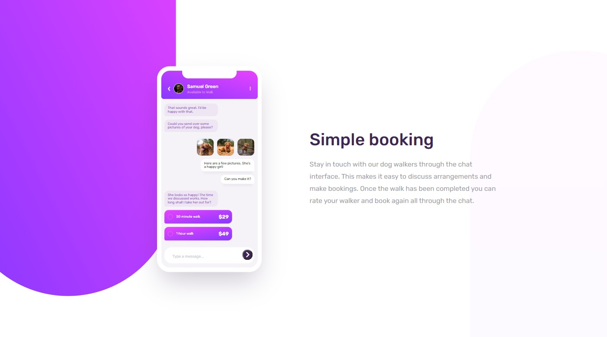

# Frontend Mentor - Chat app CSS illustration solution

This is a solution to the [Chat app CSS illustration challenge on Frontend Mentor](https://www.frontendmentor.io/challenges/chat-app-css-illustration-O5auMkFqY). Frontend Mentor challenges help you improve your coding skills by building realistic projects. 

## Table of contents

- [Overview](#overview)
  - [The challenge](#the-challenge)
  - [Screenshot](#screenshot)
  - [Links](#links)
- [My process](#my-process)
  - [Built with](#built-with)
  - [What I learned](#what-i-learned)

- [Author](#author)

## Overview

### The challenge

Users should be able to:

- View the optimal layout for the component depending on their device's screen size
- See the chat interface animate on the initial load
- See the interactive when the user type at chat box and click submit button.

### Screenshot



### Links

- Solution URL: [See solution here](https://github.com/jeffabenoja/Chat-App-CSS-Ilustration.git)
- Live Site URL: [Go to site](https://jeffabenoja.github.io/Chat-App-CSS-Ilustration/)

## My process

### Built with

- Semantic HTML5 markup
- CSS custom properties
- Flexbox
- CSS Grid
- Mobile-first workflow
- JavaScript

### What I learned

```js
document.getElementById("btn").addEventListener('click', () => {
  const text = document.getElementById('text-msg');
  text.value = "";
}, false);
```

## Author

- Facebook - [@wazsupabenoja](https://www.facebook.com/wazsupabenoja)
- Frontend Mentor - [@jeffabenoja](https://www.frontendmentor.io/profile/jeffabenoja)
- LinkedIn - [@jeffabenoja](https://www.linkedin.com/in/jeffabenoja/)

